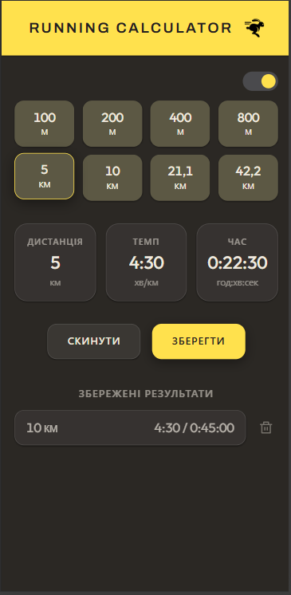

# Running Calculator

A small running calculator: enter any two of **distance**, **pace**, and **time**,
and the third is computed automatically.

🔗 **Live:** https://vestanra.github.io/running-calculator/

<p align="center">
  
</p>

## Features

- **Three-way calculation** — set any two of distance / pace / time and the
  remaining value is derived (e.g. distance + pace → time, time + distance → pace).
- **Quick race presets** — one tap for common distances: 100 m, 200 m, 400 m,
  800 m, 5 km, 10 km, 21.1 km, 42.2 km.
- **Saved results** — store calculations in the browser (`localStorage`).
  Tap a saved card to load its values back into the inputs, or delete it.
- **Light / dark theme** — toggle in the header; the choice is remembered.
- **Installable (PWA)** — "Add to Home Screen" on mobile runs it like an app,
  with a dark icon background and the yellow logo.

## Tech stack

- [React 18](https://react.dev/) + [Vite](https://vite.dev/)
- [styled-components](https://styled-components.com/) for styling and theming
- Deployed to GitHub Pages via GitHub Actions

## Getting started

```bash
npm install      # install dependencies
npm run dev      # start the dev server at http://localhost:3000
npm run build    # production build → /build
npm run preview  # serve the production build locally
npm run lint:js  # run ESLint over src/
```

## Deployment

Pushing to `main` triggers `.github/workflows/deploy.yml`, which installs,
lints, builds, and publishes `build/` to the `gh-pages` branch.
The app is served under the `/running-calculator/` base path.
